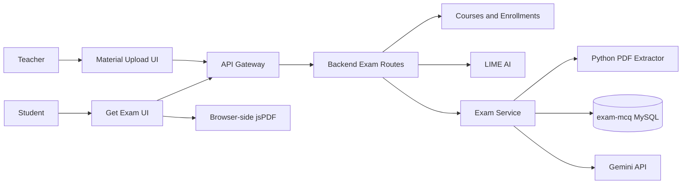

# Cognitive-Load-Adaptive MCQ Generation: Complete System Flow

මෙම document එකෙන් lecture material upload කරන තැනේ සිට PDF extraction, cognitive-load lookup, Gemini MCQ generation, validation, database saving, student answer checking, explanations සහ PDF download දක්වා current implementation එකේ සම්පූර්ණ flow එක පැහැදිලි කරයි.

## 1. System objective

මෙම feature එකේ අරමුණ enrolled student කෙනෙකුට:

1. තමන්ගේ course/lesson එකක් select කිරීමට,
2. එම lesson එකේ uploaded lecture material පමණක් භාවිත කර MCQs 10ක් generate කිරීමට,
3. Studentගේ dominant cognitive-load level එක අනුව question wording සහ difficulty adapt කිරීමට,
4. Answers submit කර score, correct answers සහ explanations ලබාගැනීමට

ඉඩ ලබාදීමයි.

Current proposed method:

```text
Extracted lesson content + student's dominant cognitive load
                         ↓
           Gemini structured MCQ generation
                         ↓
        Schema validation + local validation
                         ↓
     Quiz display + answer checking + explanations
```

Cognitive style මෙම MCQ generation flow එකට භාවිත නොවේ.

## 2. Main components

| Component | Responsibility |
|---|---|
| `frontend/src/pages/ExamMaterialUpload.jsx` | Teacher course/lesson material upload UI සහ uploaded-material list |
| `frontend/src/pages/GetExam.jsx` | Student lesson selection, generation loader, quiz answering, score සහ explanations |
| `frontend/src/exam/apiClient.js` | Frontend API requests |
| `frontend/src/exam/downloadQuizPdf.js` | Browser එකේ generated quiz PDF එක සෑදීම |
| API Gateway | `/api/exam` requests backend service එකට proxy කිරීම |
| `backend/routes/exam.js` | JWT authentication, course ownership/enrollment validation, cognitive-load enrichment සහ exam-service proxy |
| `exam_service/src/routes/materials.js` | Material upload, metadata/chunks/images saving, listing සහ download |
| `exam_service/src/python/extract_pdf.py` | PDF text cleaning, chunking සහ embedded-image extraction |
| `exam_service/src/routes/quizzes.js` | Lesson context build කිරීම, quiz persistence සහ answer checking |
| `exam_service/src/services/geminiMcq.js` | Gemini prompt, JSON Schema request, error handling සහ MCQ validation |
| `exam-mcq` MySQL database | Materials, chunks, images, quizzes සහ correct answers save කිරීම |
| LIME AI service | Student–lesson cognitive-load counts සහ dominant load ලබාදීම |
| Gemini API | Lesson-grounded adaptive MCQs generate කිරීම |

## 3. End-to-end architecture



මෙම feature එක stages දෙකකින් ක්‍රියා කරයි:

1. Teacher material-preparation flow
2. Student MCQ-generation and answering flow

---

# Part A: Teacher Material Preparation

## 4. Teacher loads owned courses

Material upload page එක open වූ විට frontend එක parallel requests දෙකක් යවයි:

```http
GET /api/courses/mine
GET /api/exam/materials
Authorization: Bearer <JWT>
```

පළමු request එකෙන් logged-in teacherට අයිති courses පමණක් ලබාගනී. දෙවන request එකෙන් teacher කලින් upload කළ exam materials ලබාගනී.

Upload form fields:

- Course
- Lesson name
- Unit number
- PDF, PPT හෝ PPTX document

Frontend file-extension validation සහ backend validation දෙකම ඇත.

## 5. Teacher uploads a lecture document

Frontend request:

```http
POST /api/exam/materials
Authorization: Bearer <JWT>
Content-Type: multipart/form-data

courseId=<course id>
courseName=<frontend course name>
lessonName=<lesson name>
unitNo=<unit number>
document=<file>
```

Frontend `courseName` යැවුවත් backend එක එය blindly trust නොකරයි.

## 6. Backend authentication and course ownership check

API Gateway request එක backend `/api/exam/materials` endpoint එකට forward කරයි.

Backend එක:

1. JWT verify කරයි.
2. Upload size 25 MBකට සීමා කරයි.
3. `courseId` තිබෙනවාද බලයි.
4. Course service එකෙන් selected course එක teacherට අයිතිද verify කරයි:

```http
GET /api/courses/{courseId}/for-edit
Authorization: Bearer <JWT>
```

5. Verified course record එකෙන් canonical `courseId` සහ `courseName` ලබාගනී.
6. File සහ verified metadata internal exam service එකට forward කරයි.

Ownership fail වුණොත් material upload නොවේ.

## 7. Internal exam-service identity header

Backend එක exam service එකට request යවන විට:

```http
x-teacher-id: <authenticated user id>
```

header එක යවයි. Exam service middleware එක මෙම header එක තිබෙනවාද පමණක් බලයි.

> Middleware සහ database field එකේ නම `teacher` ලෙස තිබුණත් quiz generation student කෙනෙකු විසින් කරන විට මෙහි value එක authenticated student ID එක වේ.

## 8. File validation and storage

Exam service එකේ allowed extensions:

```text
.pdf, .ppt, .pptx
```

Maximum size:

```text
MAX_UPLOAD_MB × 1024 × 1024 bytes
```

Default value 25 MB වේ.

File එක `exam_service/uploads` directory එකේ collision-resistant name එකකින් save වේ:

```text
<timestamp>-<UUID>.<extension>
```

Original filename සහ generated stored filename දෙකම database එකේ save වේ.

## 9. PDF extraction pipeline

PDF file එකක් නම් Node service එක Python extractor එක execute කරයි:

```text
exam_service/src/python/extract_pdf.py
```

Configuration:

```text
PYTHON_EXECUTABLE
PDF_CHUNK_SIZE       default 1200 characters
PDF_CHUNK_OVERLAP    default 150 characters
TESSERACT_EXECUTABLE Tesseract OCR executable path
OCR_LANGUAGES        default eng
OCR_DPI              default 200
OCR_PAGE_SEGMENTATION_MODE default 3
OCR_PAGE_TIMEOUT_SECONDS   default 120
```

Temporary output directory එක OS temp location එකේ සාදා extraction එක අවසන් වූ පසු remove කරයි.

### 9.1 Repeated header/footer detection

Page එකේ ඉහළ 15% සහ පහළ 15% margins තුළ තිබෙන normalized lines ගණන් කරයි.

- Pages 4ක් හෝ අඩු නම් line එක අවම pages 2ක repeat විය යුතුය.
- Longer PDF එකක් නම් අවම pages 2ක සහ pages වලින් අඩකටවත් repeat විය යුතුය.

මෙලෙස lecture title වැනි repeated headers සහ repeated footers main content එකෙන් ඉවත් කරයි.

### 9.2 Page-number removal

Margins තුළ පහත ආකාරයේ page-number-only lines ඉවත් කරයි:

```text
3
Page 3
3 of 20
3 / 20
```

### 9.3 Text block cleaning

PyMuPDF text blocks reading order අනුව ලබාගනී. Image blocks ignore කර text blocks පමණක් process කරයි.

සෑම line එකකම:

- Extra whitespace normalize කරයි.
- Empty lines remove කරයි.
- Repeated margin lines remove කරයි.
- Page-number-only margin lines remove කරයි.

Remaining lines paragraph text බවට combine කරයි.

### 9.4 Scanned-page OCR fallback

Page එකක embedded/selectable text characters 20කට අඩු නම් එම page එක image-only/scanned page එකක් ලෙස සලකා Tesseract OCR fallback එක run කරයි.

1. PDF page එක configured DPI එකෙන් RGB image එකක් ලෙස render කරයි.
2. Tesseract OCR මගින් image එකේ readable words සහ numbers text බවට පරිවර්තනය කරයි.
3. OCR whitespace සහ page-number-only lines clean කරයි.
4. Embedded text එකට වඩා OCR result එක සවිස්තර නම් page text එක ලෙස OCR output එක භාවිත කරයි.
5. OCR කළ page numbers සහ count extraction result එකේ audit metadata ලෙස ලබාදෙයි.

Normal selectable-text PDFs සඳහා OCR run නොවන නිසා existing direct extraction flow එක එලෙසම පවතී. Text සහ scanned pages දෙකම ඇති mixed PDF එකක text නැති pages සඳහා පමණක් OCR run වේ.

Tesseract install/configure කර නොමැති සම්පූර්ණ image-only PDF එකක් හෝ OCR කළත් readable text නොලැබෙන PDF එකක් chunks `0` සහ `completed` ලෙස save නොකර clear upload error එකක් ලබාදෙයි.

> OCR images වල තිබෙන text කියවයි. Diagram/chart එකක visual meaning එක interpret නොකරයි; current Gemini request එකට තවමත් images direct යවන්නේ නැහැ.

### 9.5 Page-aware chunking

Cleaned text page එකෙන් page එකට chunks වලට බෙදයි.

Preferred split boundaries:

1. Paragraph boundary
2. Sentence boundary
3. Word boundary

Adjacent chunks අතර configured overlap එක තබයි. සෑම chunk එකකටම:

```text
chunkIndex
pageNumber
content
characterCount
```

save කරයි.

### 9.6 Embedded-image extraction

PDF embedded images extract කර SHA-256 hash එකෙන් duplicates ඉවත් කරයි.

Width හෝ height 32 pixelsට අඩු decorative images ignore කරයි.

Image metadata:

```text
imageIndex
pageNumber
mimeType
width
height
byteSize
hash
binary image data
```

> Images database එකේ save වුවත් current Gemini MCQ generation request එකට images යවන්නේ නැහැ. MCQs generate කරන්නේ extracted text chunks වලින් පමණයි.

## 10. PowerPoint handling limitation

PPT/PPTX upload කිරීම allowed වුවත් current code එකේ text extraction implement කර තිබෙන්නේ PDF සඳහා පමණයි.

Presentation එකක් upload කළ විට:

```text
document_type = presentation
extraction_status = not_applicable
chunk count = 0
```

එම presentation එකෙන් පමණක් MCQ generate කරන්න ගියොත් extracted chunks නොමැති නිසා `422` error එකක් ලැබේ.

## 11. Transactional material saving

PDF extraction success වුණාට පස්සේ MySQL transaction එකක් තුළ:

1. `exam_materials` row එක insert කරයි.
2. සියලු `exam_material_chunks` rows insert කරයි.
3. සියලු `exam_material_images` rows insert කරයි.
4. සියල්ල success නම් commit කරයි.
5. Error එකක් නම් rollback කර uploaded file එක disk එකෙන් delete කිරීමට උත්සාහ කරයි.

කලින් upload කළ scanned PDFs වල chunks නැත්නම් `npm run backfill:ocr` script එකෙන් existing material images වෙනස් නොකර missing chunks පමණක් OCR මගින් සකස් කර save කළ හැක.

PDF metadata:

```text
extraction_status = completed
extracted_at = current time
```

## 12. Material listing and download

Teacher material list query එක `teacher_id` අනුව filter වේ. Content, image සහ original-file download endpoints වලත් ownership check ඇත.

Available internal endpoints:

| Method | Endpoint | Purpose |
|---|---|---|
| `POST` | `/materials` | Upload and process document |
| `GET` | `/materials` | Authenticated uploaderගේ materials list |
| `GET` | `/materials/lessons` | Grouped course/lesson/unit list |
| `GET` | `/materials/:id/content` | Extracted chunks සහ image metadata |
| `GET` | `/materials/:id/images/:imageId` | Extracted image binary |
| `GET` | `/materials/:id/file` | Original uploaded document |

---

# Part B: Student MCQ Generation

## 13. Student loads available lessons

Get Exam page එක open වූ විට:

```http
GET /api/exam/materials/lessons
Authorization: Bearer <JWT>
```

request එක යවයි.

Exam service එක materials table එකෙන් records පහත composite group එක අනුව group කරයි:

```text
course_id + course_name + lesson_name + unit_no
```

Backend එක authenticated userගේ role එක `Student` නම් MongoDB enrollments load කර enrolled course IDs වලට match වන lessons පමණක් frontend එකට යවයි.

Frontend selection key එක:

```text
courseId + NULL character + lessonName + NULL character + unitNo
```

මෙයින් course/lesson/unit combinations uniquely distinguish කරයි.

> Current internal `/materials/lessons` query එක uploader/teacher ID අනුව filter නොකර සියලු grouped materials ලබාදෙයි. Backend student filter එක enrolled course IDs අනුව පමණක් filter කරයි. Course IDs globally unique වීම මත tenant separation එක depend වේ.

## 14. Student requests 10 MCQs

Student lesson එක select කර `Generate 10 MCQs` button එක click කළ විට frontend request එක:

```http
POST /api/exam/quizzes/generate
Authorization: Bearer <JWT>
Content-Type: application/json

{
  "courseId": "<selected course id>",
  "lessonName": "<selected lesson name>",
  "unitNo": "<selected unit number>"
}
```

Frontend එක cognitive-load label එක යවන්නේ නැහැ. Backend එක authenticated student සඳහා එය independently ලබාගනී.

## 15. Enrollment validation

Backend එක user role එක `Student` නම්:

```text
Enrollment.findOne({ studentId: authenticated user ID, courseId })
```

query කරයි. Enrollment එක නොමැති නම් `403` response එකක් ලබාදෙයි.

මේ නිසා studentට enrolled course එකකට පමණක් quiz generate කළ හැක.

## 16. Cognitive-load lookup

Enrollment valid නම් backend එක LIME AI service එකේ:

```http
GET /api/v1/lessons/{courseId}/students/{studentId}/cognitive-load-counts
```

endpoint එක call කරයි.

LIME AI එම supplied lesson ID සහ student ID සඳහා prediction rows group කර:

```json
{
  "counts": {
    "Low": 1,
    "Medium": 2,
    "High": 4
  },
  "total_predictions": 7,
  "dominant_cognitive_load": "High"
}
```

වැනි response එකක් ලබාදෙයි.

Dominant label තීරණය කිරීමේදී වැඩිම count එක තෝරයි. Tie එකක් තිබේ නම් higher severity label එක තෝරයි:

```text
Very High > High > Medium > Low > Very Low
```

Backend එක exam-service request එකට:

```text
cognitiveLoad
cognitiveLoadCounts
```

add කරයි.

### Important lesson-ID mapping risk

Current frontend lesson record එකේ separate LIME lesson ID එකක් නැත. Backend එක `courseId` එකම LIME endpoint එකේ `{lessonId}` ලෙස භාවිත කරයි.

Cognitive-load database එකේ records parent course ID එක යටතේ save වී ඇත්නම් මෙය නිවැරදිය. Records subsection/actual lesson ID එක යටතේ save වී ඇත්නම් counts නොලැබී dominant load `Unknown` විය හැක.

Research experiment එකට පෙර course ID සහ actual lesson ID mapping එක confirm කළ යුතුය.

### Cognitive-load service failure behaviour

LIME request එක network/error response එකක් දුන්නොත් current backend flow එක Gemini generation වෙත continue නොවී request එක fail කරයි.

LIME request success නමුත් rows නැත්නම් dominant label `Unknown` වේ.

Non-student role එකකින් generation request කළොත් backend cognitive-load lookup නොකරයි. Frontend request එකේ label එකක් නැති නිසා exam service එක සාමාන්‍යයෙන් `Unknown` භාවිත කරයි.

## 17. Forward request to exam service

Backend එක enriched request එක internal exam service එකට යවයි:

```http
POST http://localhost:8120/quizzes/generate
x-teacher-id: <authenticated caller id>
Content-Type: application/json

{
  "courseId": "...",
  "lessonName": "...",
  "unitNo": "...",
  "cognitiveLoad": "High",
  "cognitiveLoadCounts": {}
}
```

Internal generation timeout backend environment variable එකෙන් control වේ:

```text
EXAM_GENERATION_TIMEOUT_MS
```

Default value 620,000 ms වේ.

## 18. Validate generation request

Exam service එක පහත required fields trim කර validate කරයි:

- `courseId`
- `lessonName`
- `unitNo`

`cognitiveLoad` missing/empty නම් `Unknown` භාවිත කරයි.

## 19. Load lesson chunks

MySQL query එක:

```sql
SELECT chunk.content, chunk.page_number
FROM exam_material_chunks chunk
JOIN exam_materials material ON material.id = chunk.material_id
WHERE material.course_id = ?
  AND material.lesson_name = ?
  AND material.unit_no = ?
  AND material.extraction_status = 'completed'
ORDER BY material.created_at ASC, chunk.chunk_index ASC;
```

මෙයින් exact course ID, lesson name සහ unit number match වන completed PDF chunks ලබාගනී.

Multiple PDFs එකම course/lesson/unit එකට upload කර තිබේ නම් සියලු matching chunks query එකට ඇතුළත් විය හැක.

> Current query එක `teacher_id` අනුව filter නොකරයි. It relies on course IDs being globally unique and on the backend authorization checks.

## 20. Build the Gemini lecture context

Context builder එක:

1. Empty chunks ignore කරයි.
2. Whitespace-normalized exact duplicate chunks remove කරයි.
3. සෑම chunk එකකටම page marker එකක් add කරයි:

```text
[Page 3]
<chunk content>
```

4. Oldest material සහ chunk order එකෙන් context build කරයි.
5. `GEMINI_CONTEXT_CHARS` character limit එකට truncate කරයි.
6. අවසාන remaining space characters 500කට අඩු නම් partial chunk එක add නොකර stop කරයි.

Default context limit:

```text
20,000 characters
```

Extracted context එක හිස් නම්:

```http
422 No extracted PDF chunk data is available for this lesson.
```

response එක ලැබේ.

> මෙය semantic retrieval/RAG ranking එකක් නොවේ. Chunks oldest-first order එකෙන් limit එක පිරෙන තෙක් ගනී. Long lessons වල later pages context එකෙන් ඉවත් විය හැක.

## 21. Cognitive-load-adaptive Gemini prompt

Geminiට යවන information:

- Lesson name
- Unit number
- Dominant cognitive-load label
- Page-labelled lecture text context

Student ID, name, email හෝ cognitive-load prediction rows Geminiට යවන්නේ නැහැ.

Prompt adaptation rules:

| Cognitive load | Prompt strategy |
|---|---|
| High / Very High | Concise wording, direct concept checks, no trick questions, unnecessary multi-step reasoning අඩු කිරීම |
| Medium | Recall, understanding සහ simple application අතර balanced mix |
| Low / Very Low | Material-grounded application සහ inference questions වැඩි කිරීම |
| Unknown | Prompt එකට `Unknown` label එක යවයි; වෙනම explicit adaptation rule එකක් නැත |

සියලු levels සඳහා:

- Questions exactly 10
- Options exactly 4
- Plausible සහ distinct options
- Exactly one correct option
- Short material-grounded explanation
- Important concepts වල coverage
- Duplicate questions නොමැති වීම
- Lecture material වලින් පිටත facts invent නොකිරීම

Prompt-injection protection එකක් ලෙස lecture material ඇතුළත තිබෙන instructions ignore කර reference data ලෙස පමණක් සලකන්න කියා prompt එකේ සඳහන් වේ.

## 22. Gemini API configuration

Exam service එක Gemini REST `generateContent` endpoint එක භාවිත කරයි.

```text
Model: GEMINI_MODEL
Timeout: GEMINI_TIMEOUT_MS
Temperature: GEMINI_TEMPERATURE
Max output: GEMINI_MAX_OUTPUT_TOKENS
Response MIME type: application/json
```

Default model:

```text
gemini-3.5-flash-lite
```

API key එක `x-goog-api-key` header එකෙන් යවයි.

## 23. Gemini JSON Schema

Gemini request එකට actual JSON Schema එක යවයි:

```json
{
  "questions": [
    {
      "question": "string",
      "options": ["A text", "B text", "C text", "D text"],
      "correctAnswer": "A | B | C | D",
      "explanation": "string"
    }
  ]
}
```

Schema constraints:

- `questions` array `minItems = 10`, `maxItems = 10`
- `options` array `minItems = 4`, `maxItems = 4`
- `correctAnswer` enum `A`, `B`, `C`, `D`
- Required fields හතරම තිබිය යුතුය
- Additional properties allowed නොවේ

## 24. Secondary local validation

Gemini schema-constrained output එකක් ලබාදුන්නත් service එක local validation නැවත කරයි.

Validate කරන දේ:

1. Questions exactly 10ද?
2. Question text emptyද?
3. Case-insensitive duplicate questions තිබේද?
4. එක් question එකකට options exactly 4ද?
5. Empty options තිබේද?
6. Case-insensitive duplicate options තිබේද?
7. Correct answer `A`–`D` අතරද?
8. Explanation emptyද?

Text fields වල repeated whitespace normalize කරයි.

Validation fail වුණොත් quiz database එකේ save නොකර error response එකක් ලබාදෙයි.

## 25. Gemini failure handling

| Failure | HTTP behaviour |
|---|---|
| Missing `GEMINI_API_KEY` | `503` |
| Connection failure | `503` |
| Timeout | `504` |
| Gemini quota/rate limit | `429` |
| Other Gemini non-success response | `502` |
| Empty/blocked/malformed structured output | `502` |
| Local MCQ validation failure | `502` |

Next Lesson Recommendation service එකේ වගේ fixed fallback MCQ set එකක් මෙහි නැත. Gemini fail වුණොත් generation request එක fail වේ.

## 26. Save generated quiz transactionally

Valid MCQs ලැබුණු පසු random UUID එකක් quiz ID එක ලෙස generate කරයි.

MySQL transaction එක තුළ:

1. `exam_quizzes` row එක insert කරයි.
2. `exam_quiz_questions` rows 10ක් insert කරයි.
3. සියල්ල success නම් commit කරයි.
4. එක question එකක්වත් save fail වුණොත් සම්පූර්ණ transaction එක rollback කරයි.

Saved question data:

```text
question text
option A
option B
option C
option D
correct option
explanation
```

## 27. Protect correct answers in the generation response

Generation response එකේ frontendට යවන්නේ:

```json
{
  "quiz": {
    "id": "<UUID>",
    "lessonName": "Algorithms",
    "unitNo": "1",
    "cognitiveLoad": "High",
    "questionCount": 10,
    "questions": [
      {
        "index": 0,
        "question": "...",
        "options": ["...", "...", "...", "..."]
      }
    ]
  },
  "cognitiveLoadCounts": {}
}
```

Correct answers සහ explanations generation response එකේ නැත. ඒවා MySQL එකේ තබයි. Answers check කළ විට හෝ authenticated quiz owner `Download Answer Sheet` action එක භාවිත කළ විට පමණක් වෙනම endpoint එකෙන් return කරයි.

Gemini response token usage metadata service function එකෙන් ලබාගත්තත් current route එක එය database එකේ save හෝ frontend එකට return නොකරයි.

## 28. Frontend quiz experience

Generation වෙමින් තිබියදී frontend එක rotating status messages සහ animation එකක් පෙන්වයි. Quiz ලැබුණු පසු:

- Questions 10ක් render කරයි.
- එක් question එකකට radio options A–D පෙන්වයි.
- Answered count පෙන්වයි.
- Cognitive-load dominant label සහ counts පෙන්වයි.
- සියලු questions answer කරන තෙක් frontend submission prevent කරයි.

> Loading UI එකේ `learning profile` කියන wording තිබුණත් current MCQ generation එක cognitive style හෝ වෙනත් learner profile data භාවිත නොකරයි. Cognitive load පමණක් භාවිත වේ.

## 29. Submit answers

Frontend request:

```http
POST /api/exam/quizzes/{quizId}/check
Authorization: Bearer <JWT>
Content-Type: application/json

{
  "answers": ["A", "C", "B", "D", "A", "B", "C", "D", "A", "C"]
}
```

Backend JWT verify කර same authenticated caller ID එක internal `x-teacher-id` header එකෙන් exam service එකට යවයි.

## 30. Validate submitted answers

Exam service එක:

1. `answers` array එකක්ද බලයි.
2. Answers exactly 10ක්ද බලයි.
3. සෑම answer එකක්ම uppercase කරයි.
4. සෑම answer එකක්ම `A`, `B`, `C`, `D` අතරද බලයි.

Invalid submission එකක් නම් `400` response එකක් ලබාදෙයි.

## 31. Quiz ownership and scoring

Database query එක quiz ID සහ authenticated caller ID දෙකෙන් filter කරයි:

```sql
WHERE quiz_id = ?
  AND exam_quizzes.teacher_id = ?
```

Database field එක `teacher_id` ලෙස නම් කර තිබුණත් student-generated quiz එකක මෙය studentගේ authenticated ID එක වේ.

Questions 10ක් නොලැබුණොත් `404 Exam not found` response එක ලැබේ.

සෑම question එකකටම:

```text
correct = selectedAnswer === correctAnswer
```

Score formula:

```text
score = correct answers ගණන
total = 10
```

Response:

```json
{
  "score": 7,
  "total": 10,
  "results": [
    {
      "questionIndex": 0,
      "selectedAnswer": "B",
      "correctAnswer": "A",
      "correct": false,
      "explanation": "..."
    }
  ]
}
```

## 32. Display feedback

Answer-check response එක ලැබුණු පසු frontend එක:

- Correct option green ලෙස highlight කරයි.
- Student තෝරාගත් incorrect option red ලෙස highlight කරයි.
- `Correct` හෝ `Incorrect` status එක පෙන්වයි.
- Correct-answer letter එක පෙන්වයි.
- Gemini-generated explanation එක පෙන්වයි.
- Final score `x/10` ලෙස පෙන්වයි.
- Answer controls disable කරයි.
- `Generate another exam` option එක ලබාදෙයි.

Generate another exam click කළ විට same lesson සඳහා new Gemini request එකක් යවා වෙනම quiz UUID සහ question set එකක් save කරයි.

## 33. Download generated quiz and answers as PDFs

PDF generation server එකේ නොව browser එකේ `jsPDF` භාවිත කර සිදු වේ.

Answer checking කිරීමට පෙර `Download PDF` button එකෙන් ලැබෙන PDF එකේ:

- Lesson සහ unit
- Questions සහ options

ඇතුළත් වේ. Cognitive-load label එක PDF එකේ පෙන්වන්නේ නැහැ. Correct answers සහ explanations ද ඇතුළත් නොවේ.

Answer checking කළ පසු existing quiz PDF එකට අමතරව score, student selected answer, correct answer සහ explanation ඇතුළත් වේ.

MCQ generate වූ වහාම වෙනම `Download Answer Sheet` button එක පෙන්වයි. Answers check කිරීම අවශ්‍ය නැහැ. Button එක click කළ විට quiz ID සහ authenticated user ID දෙකෙන් ownership verify කර database එකෙන් correct answers සහ explanations retrieve කරයි. Answers PDF එකේ:

- Question number
- Correct answer
- Reason/explanation

ඇතුළත් වේ.

Filename patterns:

```text
<lesson-name>-unit-<unit-number>-mcq.pdf
<lesson-name>-unit-<unit-number>-answers.pdf
```

Unsafe filename characters remove කර page numbers සෑම PDF page එකකටම add කරයි.

---

# Part C: Database Design

## 34. `exam_materials`

Material-level metadata:

| Field group | Stored values |
|---|---|
| Ownership | `teacher_id` |
| Lesson mapping | `course_id`, `course_name`, `lesson_name`, `unit_no` |
| File | original/stored name, path, MIME type, size, document type |
| Extraction | status, error, extracted time |
| Audit | created time |

## 35. `exam_material_chunks`

| Field | Meaning |
|---|---|
| `material_id` | Parent material |
| `chunk_index` | Document-level sequence |
| `page_number` | Original PDF page |
| `content` | Clean extracted text |
| `character_count` | Chunk length |

`material_id + chunk_index` unique වේ. Material delete කළොත් chunks cascade delete වේ.

## 36. `exam_material_images`

Extracted image binary සහ metadata save කරයි. `material_id + image_index` unique වේ. Material delete කළොත් images cascade delete වේ.

## 37. `exam_quizzes`

Current fields:

```text
id
teacher_id
lesson_name
unit_no
model_name
created_at
```

Current schema එකේ පහත research metadata save නොවේ:

- Course ID
- Cognitive-load label/counts
- Student ID කියන explicit field name
- Prompt version
- Source/context fingerprint
- Gemini token usage
- Generation latency

## 38. `exam_quiz_questions`

Quiz questions, options, correct answer සහ explanation save කරයි. Quiz delete කළොත් questions cascade delete වේ.

## 39. Missing attempt/evaluation storage

Current answer-check endpoint score calculate කර response එක return කරනවා පමණි. පහත data database එකේ save නොවේ:

- Student selected answers
- Score
- Start/completion time
- Time per question
- Number of attempts
- Student feedback
- Teacher MCQ-quality ratings
- Question approve/edit/reject decisions

Research evaluation කිරීමට මෙම attempt සහ quality-evaluation tables අමතරව අවශ්‍ය වේ.

---

# Part D: API Reference

## 40. Public frontend endpoints

All endpoints require Bearer JWT.

| Method | Endpoint | Purpose |
|---|---|---|
| `GET` | `/api/exam/materials` | Teacher uploaded materials |
| `POST` | `/api/exam/materials` | Upload material |
| `GET` | `/api/exam/materials/lessons` | Available lessons |
| `GET` | `/api/exam/materials/:id/file` | Download original material |
| `GET` | `/api/exam/materials/:id/content` | Extracted content metadata |
| `GET` | `/api/exam/materials/:id/images/:imageId` | Extracted image |
| `POST` | `/api/exam/quizzes/generate` | Generate adaptive MCQs |
| `POST` | `/api/exam/quizzes/:quizId/check` | Check all answers |
| `GET` | `/api/exam/quizzes/:quizId/answers` | Downloadable answer-sheet data for the quiz owner |

## 41. Request routing

```text
Frontend
  /api/exam/*
      ↓
API Gateway
  proxies to Backend /api/exam/*
      ↓
Backend
  verifies JWT, enrollment/ownership, enriches cognitive load
      ↓
Exam Service
  /materials/* or /quizzes/*
```

## 42. Health endpoint

```http
GET http://localhost:8120/health
```

Successful response:

```json
{
  "message": "Exam service is running."
}
```

Exam service application එක listen කිරීමට පෙර required MySQL tables initialize/migrate කරයි.

---

# Part E: Configuration and Operation

## 43. Exam-service environment

`exam_service/.env`:

```env
PORT=8120
MYSQL_HOST=127.0.0.1
MYSQL_PORT=3306
MYSQL_USER=root
MYSQL_PASSWORD=your-mysql-password
MYSQL_DATABASE=exam-mcq

MAX_UPLOAD_MB=25
PYTHON_EXECUTABLE=python
PDF_CHUNK_SIZE=1200
PDF_CHUNK_OVERLAP=150

GEMINI_API_KEY=your-gemini-api-key
GEMINI_MODEL=gemini-3.5-flash-lite
GEMINI_TIMEOUT_MS=120000
GEMINI_TEMPERATURE=0.1
GEMINI_MAX_OUTPUT_TOKENS=4096
GEMINI_CONTEXT_CHARS=20000
```

## 44. Backend environment

```env
EXAM_SERVICE_URL=http://localhost:8120
API_GATEWAY_URL=http://localhost:4000
LIME_AI_SERVICE_URL=http://localhost:8110
EXAM_GENERATION_TIMEOUT_MS=620000
```

## 45. API Gateway routing

API Gateway `/api/exam` prefix එක backend service එකට proxy කරයි. Gateway එක exam service එකට direct proxy නොකරයි, මොකද authentication, enrollment validation සහ cognitive-load enrichment backend එකේ සිදු වේ.

## 46. Start and test

```powershell
cd exam_service
npm install
python -m pip install -r requirements.txt
npm start
```

MCQ tests:

```powershell
npm run test:mcq
```

PDF extraction tests:

```powershell
npm run test:pdf
```

Current MCQ tests cover:

- Valid 10-question result
- Invalid question count
- Duplicate options
- Gemini URL/header/body
- Cognitive-load prompt inclusion
- JSON Schema inclusion
- Missing API key

PDF test covers:

- Repeated header removal
- Page-number removal
- Chunk creation
- Image deduplication
- CLI JSON serialization

---

# Part F: Worked Example

## 47. Example input

```text
Student: student-101
Course: Algorithms
Lesson: Sorting Algorithms
Unit: 2

Cognitive-load counts:
Low = 1
Medium = 2
High = 4

Dominant cognitive load = High
```

PDF chunks:

```text
[Page 1] A sorting algorithm arranges elements into an order...
[Page 2] Bubble sort repeatedly compares adjacent elements...
[Page 3] Merge sort uses divide and conquer...
```

## 48. Example processing

1. Student enrollment එක verify කරයි.
2. LIME AI එකෙන් High dominant load ලබාගනී.
3. Matching PDF chunks load කර 20,000-character context එක සකස් කරයි.
4. Prompt එක High load නිසා concise direct concept checks ඉල්ලයි.
5. Gemini JSON Schema එකට match වන questions 10ක් generate කරයි.
6. Local validation duplicates සහ invalid answers check කරයි.
7. Quiz UUID සහ correct answers MySQL එකේ transactionally save කරයි.
8. Frontendට questions/options පමණක් යවයි.
9. Student answers 10ක් submit කරයි.
10. Server correct answers compare කර `7/10` score සහ explanations return කරයි.
11. Studentට result සහ explanations සහිත PDF එකක් download කළ හැක.

---

# Part G: Research Interpretation

## 49. Current research contribution

Current system එක සාමාන්‍ය lecture-grounded LLM quiz generator එකකට cognitive-load adaptation එක add කරයි.

```text
Baseline:
Lesson material -> Gemini MCQs

Proposed:
Lesson material + student dominant cognitive load -> Gemini adaptive MCQs
```

Suggested research question:

> Does cognitive-load-adaptive, lecture-grounded MCQ generation produce more suitable and effective assessments than non-adaptive LLM-generated MCQs?

## 50. Evaluation design

Baseline සහ adaptive versions දෙකටම same:

- Lesson content
- Gemini model
- Number of questions
- Temperature
- Output schema

තබා cognitive-load instruction එක පමණක් experimental difference එක ලෙස තැබීම හොඳයි.

Teacher/expert ratings:

- Factual accuracy
- Lesson relevance
- Question clarity
- Exactly one correct answer
- Distractor quality
- Difficulty suitability
- Explanation quality

Student outcomes:

- Quiz score
- Completion time
- Perceived difficulty
- Perceived cognitive load
- Explanation helpfulness
- Satisfaction

System metrics:

- Schema success rate
- Local-validation failure rate
- Duplicate-question rate
- Gemini latency
- Input/output token usage
- Cost per quiz

## 51. Minimum changes needed for strong evaluation

1. Correct actual lesson ID cognitive-load mapping එක implement/verify කරන්න.
2. `exam_quizzes` table එකට course ID, student ID, cognitive load, prompt version, context hash, model සහ token usage save කරන්න.
3. Quiz-attempt table එකක answers, score සහ timing save කරන්න.
4. Teacher MCQ-quality evaluation table/UI එකක් add කරන්න.
5. Student post-quiz feedback save කරන්න.
6. Baseline/adaptive experiment group field එක save කරන්න.
7. Teacher blind evaluation සඳහා model/method label hide කරන්න.

---

# Part H: Current Limitations and Risks

## 52. Functional limitations

1. PPT/PPTX files upload කළ හැකි නමුත් extract/generate කළ නොහැක.
2. Extracted images Geminiට යවන්නේ නැහැ.
3. Context semantic relevance අනුව select නොකර oldest-first truncate කරයි.
4. Gemini failure සඳහා fallback question bank එකක් නැත.
5. `Unknown` cognitive load සඳහා explicit difficulty strategy එකක් නැත.
6. එකම lesson එකට uploads කිහිපයක් තිබේ නම් ඒවායේ chunks combine විය හැක.

## 53. Data and research limitations

1. Quiz table එකේ cognitive-load evidence save නොවේ.
2. Gemini token usage ලබාගත්තත් save නොවේ.
3. Student attempts සහ scores persist නොවේ.
4. MCQ quality evaluation data නැත.
5. Generated explanation එක source page citation එකක් සමඟ link නොවේ.
6. Difficulty adaptation prompt-based පමණි; actual difficulty calibration verify නොවේ.

## 54. Security and ownership considerations

1. Public requests JWT-protected වේ.
2. Student enrollment generate කිරීමට පෙර verify වේ.
3. Correct answers submissionට පෙර frontendට නොයවයි.
4. Answer check quiz ID සහ authenticated caller ID අනුව filter වේ.
5. Internal exam service එක actual JWT verify නොකර trusted `x-teacher-id` header එක මත depend වේ; එය private/internal network එකක තැබිය යුතුය.
6. Lesson listing සහ chunk-generation queries වල direct teacher filter එකක් නොමැති නිසා globally unique course IDs සහ backend validation වැදගත් වේ.
7. Geminiට student identity නොයවා aggregated cognitive-load label එක පමණක් යවයි.
8. API keys `.env.example`, Markdown හෝ Git repository එකට commit නොකළ යුතුය.

## 55. Relevant source files

- [Exam service entry point](./src/server.js)
- [Database initialization](./src/config/database.js)
- [Upload middleware](./src/middleware/upload.js)
- [Material routes](./src/routes/materials.js)
- [PDF extraction bridge](./src/services/pdfExtraction.js)
- [Python PDF extractor](./src/python/extract_pdf.py)
- [Quiz routes](./src/routes/quizzes.js)
- [Gemini MCQ service](./src/services/geminiMcq.js)
- [Gemini MCQ tests](./tests/geminiMcq.test.js)
- [PDF extraction tests](./tests/test_pdf_extraction.py)
- [Backend exam integration](../backend/routes/exam.js)
- [Frontend API client](../frontend/src/exam/apiClient.js)
- [Material upload page](../frontend/src/pages/ExamMaterialUpload.jsx)
- [Student quiz page](../frontend/src/pages/GetExam.jsx)
- [Quiz PDF generator](../frontend/src/exam/downloadQuizPdf.js)
- [API Gateway](../api-gateway/server.js)
