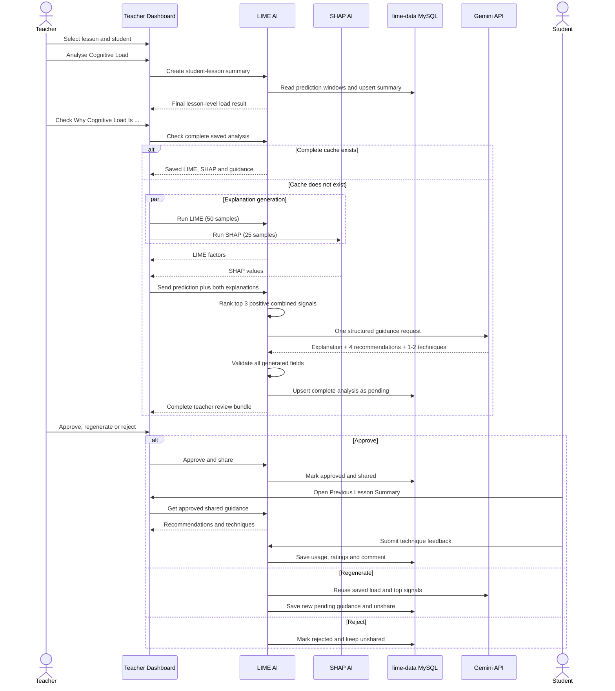

# Teacher Explanation, Student Recommendation and Study Technique: Complete Flow

මෙම document එකෙන් teacher කෙනෙකු lesson එකක් සහ student කෙනෙකු select කරන තැනේ සිට cognitive-load summary එක සාදා, LIME/SHAP evidence ලබාගෙන, Gemini මගින් **Teacher Explanation**, **Student Recommendations**, සහ **Study Techniques** එකම guidance bundle එකක් ලෙස generate කිරීම, teacher review කිරීම, student වෙත share කිරීම සහ student feedback save කිරීම දක්වා current implementation එක පැහැදිලි කරයි.

> වැදගත්: current main flow එකේ outputs තුන සඳහා වෙන වෙනම Gemini calls තුනක් නොයවයි. `student_guidance_service.py` එක Gemini call එකකින් structured JSON response එකක් ලබාගෙන sections තුනම validate කරයි.

## 1. Outputs තුනේ වෙනස

| Output | Audience | Purpose | Advice අඩංගුද? |
|---|---|---|---|
| Teacher-Friendly Explanation | Teacher | Cognitive-load level එක තෝරාගත්තේ ඇයි කියා plain language වලින් පැහැදිලි කිරීම | නැහැ |
| Student Recommendations | Student, teacher review කළ පසු | Lesson එක handle කිරීම සඳහා direct actions හතරක් ලබාදීම | ඔව් |
| Recommended Study Techniques | Student, teacher review කළ පසු | Approved catalogue එකෙන් evidence එකට ගැළපෙන techniques එකක් හෝ දෙකක් තෝරාදීම | ඔව් |

Teacher explanation එක prediction එක වෙනස් කරන්නේ නැහැ. එය already predicted cognitive-load result එක explain කරන post-hoc explanation එකකි.

## 2. Main components

| Component | Responsibility |
|---|---|
| `frontend/src/pages/StudentAnalyse.jsx` | Lesson/student selection, summary generation, cache check, LIME/SHAP requests, guidance display සහ teacher decision UI |
| `frontend/src/lime/apiClient.js` | LIME AI summary, cached analysis, LIME සහ aggregate-guidance requests |
| `frontend/src/shap/apiClient.js` | SHAP explanation request |
| `lime_ai/services/prediction_service.py` | Prediction aggregation, top-three evidence ranking, cache/save, share/reject/regenerate සහ feedback logic |
| `lime_ai/services/student_guidance_service.py` | Gemini prompt, outputs තුන generate කිරීම සහ strict validation |
| `lime_ai/services/study_technique_service.py` | Fixed five-technique catalogue සහ learner how-to details |
| `backend/routes/studentLessonSummaries.js` | Authenticated teacher/student requests LIME AI service එකට forward කිරීම |
| `frontend/src/pages/student/PreviousLessonSummary.jsx` | Teacher approve කළ guidance studentට පෙන්වීම |
| `frontend/src/components/StudyTechniqueCards.jsx` | Technique steps, optional tool links සහ student feedback UI |
| `lime-data` MySQL database | Predictions, student-lesson summaries, explanations, guidance, review state සහ feedback save කිරීම |
| Gemini API | Evidence-grounded structured guidance generate කිරීම |

## 3. High-level sequence



## 4. Data collection සහ cognitive-load summary

### Step 1: Raw lesson behaviour becomes prediction rows

Normal prediction ingestion එකෙන් `lime-data.cognitive-load` table එකට time-window/minute-level records save වේ. Current model inputs හය මෙසේය:

1. `pause_frequency`
2. `navigation_count_video`
3. `rewatch_segments`
4. `playback_rate_change`
5. `idle_duration_video`
6. `time_on_content`

එක් record එකක student ID, lesson ID, session/minute details, predicted cognitive-load label, predicted score සහ confidence ද save වේ.

### Step 2: Teacher creates the student-lesson summary

Teacher lesson සහ student select කර analysis button එක click කළ විට frontend එක පහත request එක යවයි:

```http
POST /api/lime-ai/v1/lessons/{lesson_id}/students/{student_id}/summary
```

`aggregate_and_save_student_lesson_summary()` function එක selected student සහ lesson එකට අදාළ **සියලු prediction rows** database එකෙන් ගනී. ඉන්පසු:

- behaviour fields හයේ mean values calculate කරයි;
- වැඩිපුරම ඇති cognitive-load label එක final/majority label ලෙස ගනී;
- confidence average කරයි;
- score average එක integer එකක් ලෙස ගනී;
- result එක `student-lesson-summary` table එකට student + lesson unique row එකක් ලෙස upsert කරයි.

උදාහරණයක් ලෙස prediction windows තුනේ labels `Low, High, High` නම් lesson summary label එක `High` වේ.

### Step 3: UI decides whether to offer further guidance

Current UI එක `Very Low` සහ `Low` results සඳහා “No recommendation needed” ලෙස පෙන්වා further explanation button එක hide කරයි. `Medium`, `High`, සහ `Very High` results සඳහා explanation/guidance flow එක open කළ හැක.

## 5. Saved analysis check and LIME/SHAP execution

Teacher **Check Why Cognitive Load Is ...** button එක click කළ විට මුලින් මෙය call වේ:

```http
GET /api/lime-ai/v1/lessons/{lesson_id}/students/{student_id}/analysis
```

Complete cache hit එකක් වීමට එකම saved row එකේ පහත සියල්ල තිබිය යුතුය:

- LIME explanation JSON
- SHAP explanation JSON
- teacher-friendly explanation
- study-technique JSON
- student-recommendation JSON

Complete saved result එකක් තිබේ නම් LIME/SHAP නැවත run නොකර saved data display කරයි. Saved guidance version එක current version එකට වඩා පැරණි නම් saved top signals පමණක් reuse කර Gemini guidance refresh කරයි; LIME/SHAP rerun නොවේ.

Cache එක නොමැති නම් frontend එක LIME සහ SHAP parallel run කරයි:

```http
GET /api/lime-ai/v1/lessons/{lesson_id}/predictions/{summary_id}/lime?num_features=8&num_samples=50

GET /api/shap-ai/v1/lessons/{lesson_id}/predictions/{summary_id}/shap?num_features=8&num_samples=25
```

Outputs දෙකම success වුවහොත් පමණක් aggregate guidance request එක යවයි. එකක් fail වුවහොත් available technical result එක UI එකේ පෙන්විය හැකි නමුත් complete Gemini guidance bundle එක generate නොවේ.

## 6. Top-three combined evidence selection

LIME සහ SHAP raw magnitudes එකම scale එකක නොවන නිසා backend එක එක් explainer එක වෙන වෙනම normalize කර 50:50 weight එකෙන් combine කරයි.

1. Positive LIME weights පමණක් ගනී.
2. Positive SHAP values පමණක් ගනී.
3. එක් එක් positive value එක එම explainer එකේ positive total එකෙන් divide කරයි.
4. Normalized LIME share එකේ අඩක් සහ normalized SHAP share එකේ අඩක් එකතු කරයි.
5. Combined importance descending order එකෙන් strongest features තුන තෝරයි.
6. Strongest combined value එක `1.0` වන ලෙස display normalization එකක් ද සාදයි.

Formula එක:

```text
Combined(feature)
  = 0.5 × LIME_positive_share(feature)
  + 0.5 × SHAP_positive_share(feature)
```

Negative සහ zero contributions teacher-facing “load-increasing factors” ලෙස භාවිත නොවේ.

Raw field names Gemini guidance එකට පහත everyday phrases ලෙස පරිවර්තනය වේ:

| Raw signal | Student-guidance phrase |
|---|---|
| `pause_frequency` | the student paused the video frequently |
| `navigation_count_video` | the student jumped around the video often |
| `rewatch_segments` | the student rewatched video sections |
| `playback_rate_change` | the student changed playback speed a lot |
| `idle_duration_video` | the student stayed inactive during the video for long periods |
| `time_on_content` | the student spent a long time on the lesson content |

## 7. One Gemini call creates the three sections

Frontend එක LIME/SHAP results සහ summary prediction details පහත aggregate endpoint එකට යවයි:

```http
POST /api/lime-ai/v1/aggregate-explanation
Content-Type: application/json

{
  "lesson_id": "lesson-101",
  "prediction_id": 42,
  "student_id": "student-7",
  "predicted_cognitive_load": "High",
  "predicted_score": 4,
  "confidence": 0.81,
  "lime_factors": [],
  "shap_values": [],
  "lime_explanation": {},
  "shap_explanation": {}
}
```

Backend එක top signals තෝරා `generate_student_guidance()` එක වරක් call කර Gemini වෙතින් පහත JSON shape එක ඉල්ලයි:

```json
{
  "teacher_explanation": "one paragraph",
  "study_techniques": [
    {
      "name": "exact catalogue name",
      "reason": "evidence-grounded reason",
      "matched_signals": ["exact supplied behaviour phrase"]
    }
  ],
  "lecture_recommendations": [
    "recommendation 1",
    "recommendation 2",
    "recommendation 3",
    "recommendation 4"
  ]
}
```

Gemini model, prompt version, temperature (`0.1`) සහ maximum output tokens (`1024`) research audit metadata ලෙස study-technique JSON එක තුළ save වේ.

## 8. Teacher-Friendly Explanation generation rules

Teacher explanation එකට Gemini prompt එකෙන් පහත restrictions ලබාදෙයි:

- `This student has {label} cognitive load because` යන exact start එක භාවිත කළ යුතුය.
- වචන 65–100 අතර single paragraph එකක් විය යුතුය.
- Third-person, everyday language භාවිත කළ යුතුය.
- මෙම lesson එකේ observed actions වලට පමණක් සීමා විය යුතුය.
- Cautious language, උදාහරණ ලෙස “suggests” සහ “may indicate”, භාවිත කළ යුතුය.
- LIME, SHAP, algorithm, model, feature, signal, weight, score, confidence, formula, IDs සහ raw field names නොකිය යුතුය.
- Numbers සහ percentages නොකිය යුතුය.
- Advice, recommendations හෝ study strategies අඩංගු නොවිය යුතුය.
- Permanent learner condition එකක් හෝ diagnosis එකක් ලෙස නොකිය යුතුය.

මෙම separation එක නිසා explanation එක “why was this level selected?” යන ප්‍රශ්නයට පමණක් පිළිතුරු දෙන අතර “what should the student do?” යන කොටස recommendations සහ techniques වලට යයි.

Current programmatic parser එක teacher explanation එක non-empty string එකක්ද යන්න සහ whitespace cleaning පමණක් enforce කරයි. Exact opening, 65–100 word limit සහ prohibited-term rules prompt-level constraints වේ; ඒවා separate deterministic validator එකකින් නැවත check නොකරයි. Research-quality assurance වැඩි කිරීමට ඒ rules සඳහා explicit backend validator එකක් පසුව add කළ හැක.

## 9. Student Recommendations generation rules

Gemini prompt එක exactly recommendations හතරක් ඉල්ලයි. එක් recommendation එකක්:

- studentට `you` හෝ `your` භාවිත කර direct ලෙස ලියයි;
- action verb එකකින් ආරම්භ වේ;
- එක sentence එකක් පමණක් වේ;
- action එක ප්‍රයෝජනවත් වන්නේ ඇයි කියා කෙටියෙන් කියයි.

Recommendations හතර එකතුවෙන් අවම වශයෙන් පහත needs cover කළ යුතුය:

1. lesson එකේ engaged වීම;
2. difficult content handle කිරීම;
3. understanding check කිරීම.

Output එක backend එකෙන් numbered string එකක් ලෙස save වේ:

```text
1) ...
2) ...
3) ...
4) ...
```

Current parser එක list length එක exactly හතරක්ද, එක් item එක non-empty සහ minimum cleaned length එකක් තිබේද යන්න enforce කරයි. `you/your`, action-verb start සහ one-sentence rules prompt-level constraints වන අතර separate grammar validator එකකින් enforce නොකරයි.

## 10. Study Technique selection

Geminiට arbitrary technique එකක් invent කිරීමට ඉඩ නැහැ. පහත fixed backend-approved catalogue එකෙන් technique එකක් හෝ දෙකක් පමණක් තෝරාගත හැක:

| Technique | Best used for | Optional tool |
|---|---|---|
| Mind Map | Broad lesson එක organise කර main ideas connect කිරීම | MindMeister |
| Short Notes | Long lesson එක manageable key points වලට reduce කිරීම | Notion |
| Concept Map | Concepts අතර relationships තේරුම් ගැනීම | Creately |
| Flowchart | Process, procedure, algorithm හෝ sequence එකක් follow කිරීම | Lucidchart |
| Cornell Notes | Organised notes සහ later self-testing | Evernote |

Selected technique එකකට:

- exact catalogue name එක තිබිය යුතුය;
- concise selection reason එකක් තිබිය යුතුය;
- supplied behaviour phrase එක exact ලෙස `matched_signals` තුළ copy කළ යුතුය;
- unknown/duplicate technique හෝ invented/paraphrased signal තිබේ නම් whole Gemini output එක reject වේ.

Tool links, description, best-for text, estimated time, setup steps, account/payment notice සහ paper alternative static catalogue metadata වේ. ඒවා saved recommendation එක retrieve කරන විට attach කරන නිසා ඒ සඳහා තවත් Gemini call එකක් අවශ්‍ය නොවේ.

## 11. Database saving and cache structure

Successful aggregate analysis එක `lime-data.student-lesson-top-signals` table එකට student + lesson unique row එකක් ලෙස upsert වේ.

Main saved fields:

- student, lesson සහ prediction IDs;
- predicted load, score සහ confidence;
- top 1–3 signal names, combined values සහ normalized values;
- complete LIME සහ SHAP JSON;
- teacher explanation සහ source;
- study techniques, selection evidence, teacher review සහ student feedback JSON;
- student recommendations JSON;
- `shared_to_student` සහ `shared_at`.

Newly generated or regenerated guidance state එක:

```json
{
  "teacher_review": {
    "status": "pending",
    "reviewed_at": null,
    "rejection_reason": null,
    "regeneration_count": 0
  },
  "student_feedback": {}
}
```

## 12. Teacher human-in-the-loop decision

Teacher review එක explanation, recommendations සහ study techniques යන complete bundle එකටම අදාළ වේ.

### Approve and Send to Student

- review status `approved` වේ;
- review timestamp save වේ;
- `shared_to_student = true` වේ;
- studentගේ Previous Lesson Summary page එකෙන් result එක ලබාගත හැක.

### Reject Guidance

- review status `rejected` වේ;
- optional rejection reason එක save වේ;
- result එක studentට share නොවේ.

### Regenerate Guidance

- saved cognitive-load label සහ saved top-three signals reuse කරයි;
- LIME සහ SHAP rerun නොකර Gemini guidance bundle එක පමණක් නැවත generate කරයි;
- regeneration count එක වැඩි කරයි;
- new result එක `pending` සහ unshared වේ;
- තිබූ student feedback `feedback_history` එකට archive කරයි.

Current UI එකේ teacherට output text manually edit කිරීමේ option එකක් නැහැ; approve, regenerate හෝ reject පමණක් ඇත.

## 13. Student view and feedback

Student Previous Lesson Summary page එක load කළ විට authenticated student ID එක භාවිත කර approved/shared records පමණක් retrieve කරයි:

```http
GET /api/student-lesson-summaries/me
```

Current student UI එක lesson name, cognitive-load level, teacher-shared recommendations සහ recommended study-technique cards පෙන්වයි. Teacher explanation backend response එකේ තිබුණත් current student page එකේ render නොකරයි.

Technique එකකට studentට පහත feedback ලබාදිය හැක:

- technique එක use කළාද: Yes/No;
- use කළේ නම් helpfulness: 1–5;
- use කළේ නම් ease of use: 1–5;
- optional comment.

Feedback submit කිරීමට guidance එක teacher approve/share කර තිබිය යුතු අතර feedback technique name එක actual recommended technique එකක් විය යුතුය. එකම technique එකට නැවත submit කළ විට latest feedback value එක update වේ.

## 14. Complete worked example

### Input context

```text
Student: student-7
Lesson: lesson-101
Summary cognitive load: High
```

Assume positive explainer outputs මෙසේය:

| Feature | LIME weight | LIME share | SHAP value | SHAP share |
|---|---:|---:|---:|---:|
| `time_on_content` | 0.50 | 0.50 | 0.40 | 0.40 |
| `pause_frequency` | 0.30 | 0.30 | 0.25 | 0.25 |
| `playback_rate_change` | 0.20 | 0.20 | 0.35 | 0.35 |

Combined values:

```text
time_on_content      = 0.5(0.50) + 0.5(0.40) = 0.450
pause_frequency      = 0.5(0.30) + 0.5(0.25) = 0.275
playback_rate_change = 0.5(0.20) + 0.5(0.35) = 0.275
```

Therefore, top signals and display-normalized values are approximately:

| Rank | Signal | Combined | Normalized against maximum |
|---:|---|---:|---:|
| 1 | `time_on_content` | 0.450 | 1.000 |
| 2 | `pause_frequency` | 0.275 | 0.611 |
| 3 | `playback_rate_change` | 0.275 | 0.611 |

Tie එකක් තිබේ නම් canonical feature name එක deterministic alphabetical tie-breaker එකක් ලෙස භාවිත වේ.

### Example Teacher Explanation

> This student has High cognitive load because the learner spent a long time working through this lesson and paused frequently while trying to follow the material. The repeated changes in playback speed also suggest that understanding the content in real time may have required extra concentration. These actions do not prove that every part was difficult, but together they indicate that the lesson demanded sustained mental effort. Therefore, the combined behaviour supports the reported High cognitive load level.

මෙහි technical names, weights, confidence හෝ advice නැති අතර evidence එක cautious plain language එකකට පරිවර්තනය කර ඇත.

### Example Student Recommendations

```text
1) Pause after each main idea so you can process the information before continuing.
2) Replay the most difficult section at a comfortable speed to clarify details you may have missed.
3) Write down the key point from each section to keep your attention focused on the lesson.
4) Answer a short self-check question after each topic to confirm your understanding before moving on.
```

### Example Study-Technique output

```json
{
  "technique": "short notes",
  "title": "Short Notes",
  "selection_reason": "Because the student spent a long time on the lesson content and paused frequently, short notes can reduce the lesson into manageable review points.",
  "matched_signals": [
    "the student spent a long time on the lesson content",
    "the student paused the video frequently"
  ],
  "selection_method": "constrained gemini"
}
```

Teacher මේ complete bundle එක approve කළ පසු student recommendations සහ technique guide එක දකී. Student Short Notes use කළේ නම් example feedback එක මෙසේ save විය හැක:

```json
{
  "technique": "short notes",
  "used": true,
  "helpfulness": 4,
  "ease_of_use": 5,
  "comment": "The short summary made revision easier.",
  "submitted_at": "<UTC timestamp>"
}
```

## 15. API summary

| Action | Endpoint |
|---|---|
| Create/update student-lesson load summary | `POST /api/v1/lessons/{lesson_id}/students/{student_id}/summary` |
| Check complete saved analysis | `GET /api/v1/lessons/{lesson_id}/students/{student_id}/analysis` |
| Run LIME | `GET /api/v1/lessons/{lesson_id}/predictions/{prediction_id}/lime` |
| Run SHAP | `GET /api/shap-ai/v1/lessons/{lesson_id}/predictions/{prediction_id}/shap` |
| Combine evidence and generate guidance | `POST /api/v1/aggregate-explanation` |
| Approve/share guidance | `POST /api/v1/lessons/{lesson_id}/students/{student_id}/share-guidance` |
| Reject guidance | `POST /api/v1/lessons/{lesson_id}/students/{student_id}/reject-guidance` |
| Regenerate guidance | `POST /api/v1/lessons/{lesson_id}/students/{student_id}/regenerate-guidance` |
| List student’s shared guidance | `GET /api/v1/students/{student_id}/shared-guidance` |
| Save technique feedback | `POST /api/v1/students/{student_id}/lessons/{lesson_id}/technique-feedback` |

Frontend teacher/student actions සඳහා `/api/student-lesson-summaries/*` backend gateway routes ද භාවිත වේ.

## 16. Failure behaviour and current limitations

- Gemini API key/model/configuration issue එකක් හෝ invalid JSON/validation failure එකක් ඇති වුවහොත් aggregate guidance request එක `503` error එකක් දෙයි. මෙම flow එකට deterministic text fallback එකක් නැහැ.
- LIME සහ SHAP දෙකම success නොවුණහොත් complete guidance bundle එක generate නොවේ.
- Fixed catalogue නිසා technique safety/consistency වැඩි නමුත් selection එක techniques පහකට සීමා වේ.
- Teacher decision එක section-by-section නොව complete bundle එකට අදාළ වේ.
- Teacherට guidance manually edit කළ නොහැක.
- Rejection reason optional වේ.
- Student feedback latest value එක technique name එක යටතේ JSON field එකක save වේ; separate normalized evaluation table එකක් නොවේ.
- Current teacher page එකේ confidence hide කර තිබුණත් database/API payload වල research evidence ලෙස තවම save වේ.
- `human_explanation_service.py` සහ `lecture_support_service.py` වැනි older separate service files තිබුණද current aggregate flow එක `student_guidance_service.py` single-call path එක භාවිත කරයි.

## 17. Research evaluation සඳහා ලබාගත හැකි data

මෙම implementation එකෙන් පහත evaluations කළ හැක:

1. Teacher explanation clarity සහ evidence consistency ratings;
2. Teacher approve/reject rate සහ regeneration count;
3. Rejection reasons වල thematic analysis;
4. Recommended technique usage rate;
5. Used techniques වල mean helpfulness සහ ease-of-use ratings;
6. Behaviour signal අනුව selected technique distribution;
7. Guidance version, prompt version සහ Gemini model අනුව comparison;
8. Teacher approval සහ student feedback අතර relationship analysis.

Teacher approval එක alone “recommendation effective” බව prove නොකරයි. Stronger evaluation එකක් සඳහා teacher relevance/actionability ratings, student usage, helpfulness/ease ratings සහ possible learning outcome measure එකක් එකට report කිරීම වඩා සුදුසුය.

## 18. Short flow summary

```text
Lesson behaviour windows
        ↓
Cognitive-load predictions in MySQL
        ↓
Student + lesson aggregation
        ↓
Saved-analysis check
        ↓ cache miss
Parallel LIME (50) + SHAP (25)
        ↓
Positive evidence normalization and top-3 ranking
        ↓
One constrained Gemini request
        ↓
Teacher explanation + 4 recommendations + 1-2 techniques
        ↓
Backend validation and pending database save
        ↓
Teacher approve / regenerate / reject
        ↓ approve
Student receives recommendations and technique guides
        ↓
Student usage, helpfulness, ease and comment feedback
```
