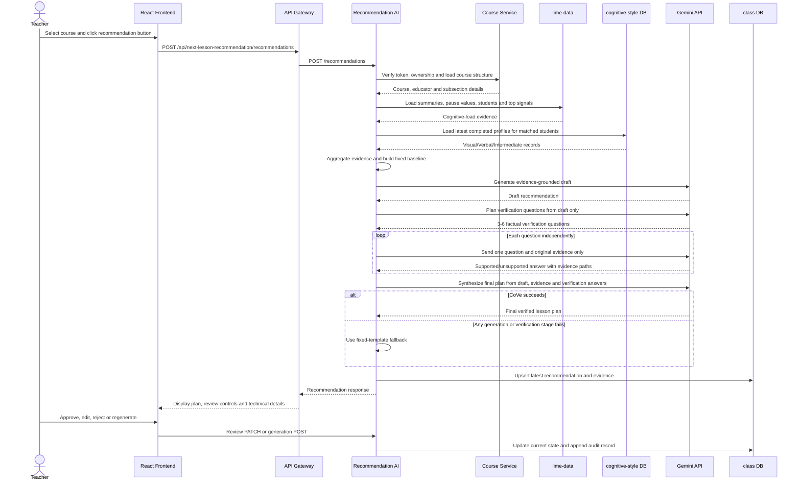

# Next Lesson Recommendation: Complete Data and Processing Flow

මෙම document එකෙන් teacher course එක select කරන තැනේ සිට evidence-based next-lesson recommendation එක generate කරලා, database එකේ save කරලා, teacher review එක record කරන තෙක් current implementation එකේ සම්පූර්ණ flow එක පැහැදිලි කරයි.

## 1. System objective

මෙම service එකේ අරමුණ class එකේ තිබෙන evidence එක එකතු කර teacherට ඊළඟ lesson එක සැලසුම් කිරීමට actionable recommendation එකක් ලබාදීමයි.

භාවිත කරන evidence categories:

1. Cognitive-load distribution
2. High සහ Very High load percentage
3. Common LIME/SHAP learning signals
4. Studentsගේ latest completed cognitive-style distribution
5. Course සහ lesson context
6. Pause-frequency box-plot statistics

Gemini available නම් evidence-based recommendation එක generate වේ. Gemini unavailable හෝ invalid output එකක් ලැබුණොත් dominant cognitive-load label එක මත පදනම් වූ fixed template එක automatic fallback එක ලෙස භාවිත වේ.

## 2. Main components

| Component | Responsibility |
|---|---|
| `frontend/src/pages/NextLessonRecommendation.jsx` | Course selection, generation request, recommendation display, box plot, technical evidence සහ teacher review UI |
| API Gateway | Frontend request එක recommendation service එකට proxy කිරීම |
| `recommendation_ai/server.js` | Course ownership check, evidence collection, aggregation, Gemini call, fallback, saving සහ review APIs |
| Course service | Selected course එක authenticated teacherට අයිතිද verify කිරීම සහ course structure ලබාදීම |
| `lime-data.student-lesson-summary` | එක් student–lesson එකකට final cognitive-load summary සහ pause frequency |
| `lime-data.student-lesson-top-signals` | එක් student–lesson explanation එකේ top LIME/SHAP signals |
| `cognitive-style-explanations.cognitive-style-analysis` | Student-level completed cognitive-style profiles |
| Gemini API | Structured evidence එක teacher-friendly next-lesson plan එකක් බවට පත් කිරීම |
| `class.next_lesson_recommendations` | Course එකක latest recommendation සහ evidence snapshot එක save කිරීම |
| `class.next_lesson_recommendation_reviews` | Approve, edit, reject සහ regenerate history එක save කිරීම |

## 3. High-level sequence



## 4. Step-by-step processing flow

### Step 1: Frontend loads teacher courses

Page එක open වූ විට frontend එක පහත endpoint එකෙන් authenticated teacherගේ uploaded courses load කරයි:

```http
GET /api/courses/mine
Authorization: Bearer <token>
```

Courses තිබේ නම් පළමු course එක default selection එක ලෙස set වේ. Teacher වෙනත් course එකක් select කළ විට කලින් තිබූ recommendation, review state සහ technical-details state reset වේ.

### Step 2: Teacher requests a recommendation

Teacher action button එක click කළ විට frontend එක පහත request එක යවයි:

```http
POST /api/next-lesson-recommendation/recommendations
Authorization: Bearer <token>
Content-Type: application/json

{
  "courseId": "<24-character MongoDB course id>"
}
```

API Gateway එක `/api/next-lesson-recommendation` prefix එක ඉවත් කර request එක recommendation service එකේ `/recommendations` endpoint එකට forward කරයි.

### Step 3: Validate course ID and ownership

Recommendation service එක:

1. `courseId` එක 24-character hexadecimal MongoDB ID එකක්ද බලයි.
2. Bearer token එක request එකෙන් ලබාගනී.
3. Course service එකේ පහත endpoint එක call කරයි:

```http
GET /api/courses/{courseId}/for-edit
Authorization: Bearer <token>
```

මෙම step එකෙන්:

- Course එක ඇත්තටම තිබෙනවාද?
- Logged-in teacherට course එක අයිතිද?
- Course name, educator ID සහ lesson structure මොනවාද?

යන දේ verify කරයි. Ownership check එක fail වුණොත් recommendation generation එක නවතී.

### Step 4: Resolve matched lesson IDs

Selected course එක සඳහා matched IDs set එකක් සකස් කරයි:

```text
matched lesson IDs = selected parent course ID + all subsection IDs
```

Duplicate IDs automatically ඉවත් වේ. Section IDs වෙනම add නොකරයි; subsection ID තිබේ නම් එය add කරයි.

උදාහරණය:

```text
Course ID: course-01
Subsections: lesson-01, lesson-02, lesson-03

Matched IDs:
[course-01, lesson-01, lesson-02, lesson-03]
```

මෙම matched IDs භාවිතයෙන් selected course එකට අදාළ cognitive-load data පමණක් query කරයි.

### Step 5: Load cognitive-load distribution

Source table:

```text
lime-data.student-lesson-summary
```

Conceptual query:

```sql
SELECT predicted_cognitive_load, COUNT(*)
FROM student-lesson-summary
WHERE lesson_id IN (<matched lesson IDs>)
GROUP BY predicted_cognitive_load;
```

Labels පහත standard values වලට normalize වේ:

```text
Very Low, Low, Medium, High, Very High, Unknown
```

`Moderate` value එකක් ලැබුණොත් `Medium` ලෙස normalize වේ. Tie එකක් තිබේ නම් safety-first rule එකක් ලෙස higher cognitive-load category එක dominant label එක වේ.

> වැදගත්: මෙහි count එක unique students ගණන නොවේ. එය එක් student–lesson final summary එකක් ලෙස ගණන් කරන student–lesson results ගණනයි. Student කෙනෙක් lessons තුනක් complete කළොත් results තුනක් ලෙස count විය හැක.

Data කිසිවක් නොමැති නම් service එක `404` response එකක් ලබාදෙයි; Gemini හෝ fallback recommendation එකක් generate නොකරයි.

### Step 6: Build pause-frequency box-plot data

එම `student-lesson-summary` table එකෙන්:

```sql
SELECT predicted_cognitive_load, pause_frequency
FROM student-lesson-summary
WHERE lesson_id IN (<matched lesson IDs>);
```

Pause values cognitive-load label අනුව group කර පහත statistics calculate කරයි:

```text
Minimum, Q1, Median, Q3, Maximum
```

Frontend එක මෙම values ApexCharts box plot එකකින් පෙන්වයි. මෙය descriptive evidence එකක් පමණි.

> Box plot එකෙන් correlation හෝ causation prove නොවේ. උදාහරණයක් ලෙස High load සහ pauses එකට පෙනීමෙන් pauses නිසා High load ඇතිවුණා කියලා claim කළ නොහැක.

### Step 7: Identify course students

Selected lesson IDs වල summaries තිබෙන distinct student IDs ලබාගනී:

```sql
SELECT DISTINCT student_id
FROM student-lesson-summary
WHERE lesson_id IN (<matched lesson IDs>);
```

මෙම IDs raw form එකෙන් Geminiට යවන්නේ නැහැ. Cognitive-style distribution එක සකස් කිරීමට පමණක් භාවිත වේ.

### Step 8: Aggregate common LIME/SHAP signals

Source table:

```text
lime-data.student-lesson-top-signals
```

Selected lessons සඳහා සෑම row එකකම:

```text
top_1_signal, top_1_normalized_value
top_2_signal, top_2_normalized_value
top_3_signal, top_3_normalized_value
```

load කරයි. එකම signal එක rows කිහිපයක තිබේ නම්:

1. Occurrence count එක වැඩි කරයි.
2. Normalized importance values වල average එක calculate කරයි.
3. පළමුව occurrence count අනුව sort කරයි.
4. Tie එකක් තිබේ නම් average importance අනුව sort කරයි.
5. Class එකේ common signals top 3 තෝරයි.

උදාහරණය:

```json
[
  {
    "signal": "pause_frequency",
    "occurrences": 8,
    "averageImportance": 0.62
  },
  {
    "signal": "playback_rate_change",
    "occurrences": 5,
    "averageImportance": 0.41
  }
]
```

මෙම table එක unavailable නම් generation එක නවත්වන්නේ නැහැ. Empty signal list එකක් භාවිත කර ඉදිරියට යයි.

### Step 9: Load cognitive-style distribution

Source table:

```text
cognitive-style-explanations.cognitive-style-analysis
```

Course students සඳහා completed profiles load කරයි:

```sql
SELECT student_id, lesson_id, cognitive_style
FROM cognitive-style-analysis
WHERE student_id IN (<course student IDs>)
  AND analysis_status = 'completed'
  AND cognitive_style IS NOT NULL
ORDER BY updated_at DESC, id DESC;
```

Rows updated time අනුව newest-first order එකෙන් ලැබෙන නිසා එක් student කෙනෙකුගේ latest completed profile එක පමණක් distribution එකට භාවිත වේ.

Raw labels normalize වන ආකාරය:

| Raw value | Display/aggregation value |
|---|---|
| `Visual` | `Visual` |
| `Verbal` | `Verbal` |
| `Moderate`, `Intermediatory`, `Moderate/Intermediatory` | `Intermediate` |
| Unknown value | `Unknown` |

> Cognitive style එක lesson එකෙන් lesson එකට නැවත calculate කරන evidence එකක් ලෙස මෙහි භාවිත නොවේ. එය studentගේ latest completed profile එක ලෙස course distribution එකට එක වරක් count වේ.

Cognitive-style database/table එක unavailable නම් zero counts භාවිත කර recommendation generation එක ඉදිරියට යයි.

#### Cognitive style recommendation එකට බලපාන ආකාරය

Individual student cognitive-style labels Geminiට යවන්නේ නැහැ. `Visual`, `Verbal`, `Intermediate` සහ `Unknown` ලෙස aggregated class distribution එක පමණක් evidence snapshot එකට ඇතුළත් වේ. උදාහරණයක් ලෙස `Visual = 44.4%` නම් diagram එකක් හෝ worked visual example එකක් යෝජනා කළ හැක. නමුත් “Visual studentsට verbal explanations වලින් ඉගෙනගන්න බැහැ” වැනි permanent ability claim එකක් කිරීමට අවසර නැහැ. Cognitive-style observations නොමැති නම් model එක එම category එක omit කළ යුතුය.

### Step 10: Build the evidence snapshot

සියලු aggregated data එක structured evidence object එකකට පරිවර්තනය කරයි:

```json
{
  "promptVersion": "evidence-next-lesson-v1",
  "course": {
    "name": "Example Course",
    "lessonCount": 3,
    "lessonTitles": ["Lesson A", "Lesson B"]
  },
  "cognitiveLoad": {
    "counts": {
      "Very Low": 1,
      "Low": 0,
      "Medium": 2,
      "High": 5,
      "Very High": 1,
      "Unknown": 0
    },
    "classifiedTotal": 9,
    "aggregationUnit": "one final result per student per lesson",
    "highOrVeryHighPercentage": 66.7,
    "dominant": "High"
  },
  "commonSignals": [],
  "cognitiveStyles": {
    "counts": {
      "Visual": 4,
      "Verbal": 2,
      "Intermediate": 3,
      "Unknown": 0
    },
    "total": 9,
    "percentages": {
      "Visual": 44.4,
      "Verbal": 22.2,
      "Intermediate": 33.3,
      "Unknown": 0
    }
  },
  "pauseFrequencyBoxPlot": []
}
```

High/Very High percentage formula:

```text
(High count + Very High count) / classified results × 100
```

`Unknown` results classified denominator එකට ඇතුළත් නොවේ.

### Step 11: Always prepare the fixed baseline

Gemini call එකට පෙර dominant cognitive-load label එක අනුව fixed recommendation එකක් සකස් කරයි.

උදාහරණ:

| Dominant load | Baseline strategy |
|---|---|
| Very High | Short recap, small steps, worked examples, frequent checks සහ pauses |
| High | Slower pacing, prerequisite review, scaffolding සහ understanding checks |
| Medium | Similar pacing, retrieval questions සහ guided example |
| Low | More application, less scaffolding සහ explanation/comparison tasks |
| Very Low | Faster review, extension tasks සහ higher-order problems |

මෙය:

1. Research baseline එක ලෙස භාවිත කළ හැක.
2. Gemini unavailable වන විට dependable fallback එක ලෙස භාවිත වේ.

### Step 12: Generate the draft and run Chain-of-Verification

Geminiට individual student IDs හෝ raw database rows යවන්නේ නැහැ. Aggregated evidence snapshot එක පමණක් යවයි.

Current prompt rules:

- Supplied evidence පමණක් භාවිත කරන්න.
- Student behaviour හෝ causes invent නොකරන්න.
- Cognitive style permanent learner trait එකක් ලෙස නොපෙන්වන්න.
- Teacher-friendly English words 130–190 අතර ලියන්න.
- Short class insight එකකින් ආරම්භ කරන්න.
- Exactly numbered actions තුනක් ලබාදෙන්න.
- සෑම action එකක්ම supplied evidence එකකට සම්බන්ධ කරන්න.
- Evidence නොමැති category එකක් guess නොකර omit කරන්න.
- Gemini, prompts, databases, LIME, SHAP, algorithms හෝ confidence scores mention නොකරන්න.

API configuration:

```text
Model: GEMINI_MODEL
Temperature: 0.2
Maximum output tokens: 450
Timeout: GEMINI_TIMEOUT_MS
```

Successful output එක characters 80කට වඩා කෙටි නම් incomplete output එකක් ලෙස reject කර fallback එක භාවිත වේ.

#### CoVe prompts සහ stages

මෙම implementation එක single prompt එකක් මත පමණක් රඳා නොපවතී. Dhuliawala et al. (2024)ගේ Chain-of-Verification method එක අනුව වෙන වෙනම අරමුණු සඳහා prompts භාවිත කරයි:

1. **Draft-generation prompt:** Aggregated evidence එකෙන් initial next-lesson recommendation එක generate කරයි.
2. **Verification-question prompt:** Draft එකේ factual, numerical සහ causal claims පරීක්ෂා කිරීමට questions 3–6ක් සකස් කරයි. මෙම stage එකට draft එක ලබාදෙන නමුත් evidence snapshot එක ලබා නොදේ.
3. **Independent-answer prompt:** එක් question එක සහ original evidence snapshot එක පමණක් ලබාදී answer එක independently generate කරයි. Complete draft එක මෙම stage එකට ලබා නොදේ.
4. **Final-synthesis prompt:** Draft, original evidence සහ independent answers භාවිත කර unsupported claims ඉවත් හෝ correct කර final recommendation එක සකස් කරයි.

Supported answer එකකට `cognitiveLoad.dominant`, `cognitiveStyles.percentages.Visual` හෝ `commonSignals[0].signal` වැනි valid evidence path එකක් තිබිය යුතුය. Model එක evidence snapshot එකේ නොමැති path එකක් ලබාදුන්නොත් verification එක fail වේ.

උදාහරණය:

```text
Draft claim:
"70% of results were High or Very High because the lesson was difficult."

Verification 1:
70% High/Very High -> Supported
Evidence path -> cognitiveLoad.highOrVeryHighPercentage

Verification 2:
The lesson was difficult -> Unsupported
Reason -> Evidence snapshot එකේ lesson difficulty හෝ cause එකක් නැහැ

Final text:
"70% of the classified results were High or Very High. Begin the next lesson
with a short recap and staged examples."
```

### Step 13: Apply automatic fallback

Fallback එක භාවිත කිරීමට පෙර service එක draft generation, verification-question planning, independent evidence answering සහ final verified synthesis යන CoVe stages හතර complete කිරීමට උත්සාහ කරයි. Final response එක accept කරන්නේ `fullyGrounded: true`, valid recommendation text සහ unsupported claims final text එකේ නැති අවස්ථාවක පමණි. මෙම CoVe implementation එක Next Lesson Recommendation feature එකට පමණක් අදාළ වේ.

පහත අවස්ථාවල fixed baseline recommendation එක final output එක වේ:

- `GEMINI_API_KEY` configure කර නොමැති විට
- Gemini API timeout/network failure
- Gemini non-success HTTP response
- Empty හෝ incomplete Gemini output
- Invalid JSON response
- Valid verification questions තුනකට වඩා අඩු වූ විට
- Supported answer එකකට valid evidence path එකක් නොමැති විට
- Final synthesis එක `fullyGrounded: false` වූ විට
- Unsupported claim එක final recommendation එකේ තවම තිබෙන විට

Response/database values:

| Situation | `recommendation_source` | `generation_model` |
|---|---|---|
| Complete CoVe success | `gemini-cove-verified` | Configured Gemini model |
| Gemini failure | `fixed-template` | `NULL` |

Gemini failure reason එක `fallback_reason` field එකේ save වේ.

### Step 14: Save or update the recommendation

Latest state table:

```text
class.next_lesson_recommendations
```

`teacher_id + course_id` unique combination එකක් නිසා course එකකට teacherගේ latest recommendation එක එක row එකක තබයි.

ප්‍රධාන saved values:

| Field | Meaning |
|---|---|
| `teacher_id`, `course_id`, `course_name` | Recommendation ownership/context |
| `matched_lesson_ids` | Evidence query සඳහා භාවිත කළ course/subsection IDs |
| `very_low_count` ... `unknown_count` | Cognitive-load distribution |
| `total_observations` | Total student–lesson summary rows |
| `dominant_cognitive_load` | Highest-frequency load label |
| `recommendation_text` | Teacherට දැනට පෙන්වන current/final text |
| `generated_recommendation_text` | CoVe final text හෝ fallback text |
| `original_draft_text` | CoVe verification එකට පෙර Gemini draft text |
| `baseline_recommendation_text` | Fixed label-based baseline |
| `recommendation_source` | `gemini-cove-verified` හෝ `fixed-template` |
| `generation_model` | Gemini model name |
| `evidence_snapshot` | Generation time එකේ complete aggregated evidence JSON |
| `fallback_reason` | Gemini fail වුණේ ඇයිද |
| `verification_method` | `Chain-of-Verification` |
| `verification_status` | `verified`, `failed`, හෝ `not-run` |
| `verification_report` | Questions, evidence paths, support decisions සහ removed claims JSON |
| `teacher_review_status` | `pending`, `approved`, `edited`, හෝ `rejected` |
| `teacher_review_reason` | Teacher review note/rejection reason |
| `box_plot_data` | Frontend chart එක සඳහා statistics |

Course එකට කලින් recommendation එකක් තිබුණොත් regeneration කිරීමට පෙර old recommendation එක audit table එකට `regenerated` action එකක් ලෙස save කරයි. ඉන්පසු latest row එක new evidence සහ recommendation එකෙන් update කර review status එක නැවත `pending` කරයි.

### Step 15: Return and display the result

Frontend response එකෙන්:

- Box plot
- Generated next-lesson plan
- Recommendation source
- Teacher-review state
- Collapsible technical evidence

පෙන්වයි.

Current page order:

1. Cognitive-load pause-frequency box plot
2. Recommended next-lesson plan සහ teacher review
3. `See Technical Details` expandable evidence section

### Step 16: Teacher review

Teacherට actions හතරක් ඇත:

#### Approve

```http
PATCH /recommendations/{courseId}/review

{
  "action": "approved"
}
```

#### Edit

```json
{
  "action": "edited",
  "recommendation": "Teacher revised lesson plan...",
  "reason": "Optional note"
}
```

Edited recommendation එක අවම characters 20ක් විය යුතුය.

#### Reject

```json
{
  "action": "rejected",
  "reason": "This plan does not fit the available lesson time."
}
```

Reject reason එක අවම characters 3ක් විය යුතුය.

#### Regenerate

Frontend එක නැවත generation `POST` request එක යවයි. Current recommendation එක audit history එකට `regenerated` ලෙස save වී latest row එක replace වේ.

Approve, edit සහ reject actions සියල්ල:

1. Current recommendation row එක update කරයි.
2. `next_lesson_recommendation_reviews` audit table එකට immutable history row එකක් add කරයි.

## 5. API summary

| Method | Endpoint | Purpose |
|---|---|---|
| `POST` | `/recommendations` | Evidence load කර new recommendation generate/regenerate කිරීම |
| `PATCH` | `/recommendations/:courseId/review` | Approve, edit හෝ reject කිරීම |
| `GET` | `/recommendations/:courseId` | Course එකේ saved latest recommendation ලබාගැනීම |
| `GET` | `/health` | Service සහ database connectivity check කිරීම |

Frontend/API Gateway public prefix එක:

```text
/api/next-lesson-recommendation
```

උදාහරණයක්:

```text
Frontend request:
/api/next-lesson-recommendation/recommendations

Recommendation service request:
/recommendations
```

## 6. Worked example

Teacher `Data Structures` course එක select කළා කියමු.

### Loaded evidence

```text
Matched lesson IDs: course ID + lesson A + lesson B

Cognitive-load final results:
Very Low = 1
Low = 0
Medium = 2
High = 5
Very High = 1

Dominant load = High
High/Very High percentage = 6 / 9 × 100 = 66.7%

Common signals:
1. pause_frequency
2. playback_rate_change
3. lesson_duration

Latest cognitive styles:
Visual = 4
Verbal = 2
Intermediate = 3
```

### Processing result

1. System එක High label fixed baseline එක සකස් කරයි.
2. සියලු evidence structured JSON එකකට පරිවර්තනය කරයි.
3. Gemini aggregated evidence එකෙන් draft recommendation එක generate කරයි.
4. Draft එකේ factual/causal claims සඳහා verification questions 3-6ක් plan කරයි.
5. සෑම question එකක්ම full draft එක නොමැතිව original evidence එකෙන් independently answer කරයි.
6. Unsupported claims remove/correct කර final verified plan එක synthesize කරයි.
7. Complete CoVe success නම් `gemini-cove-verified` source එකෙන් save වේ.
8. ඕනෑම CoVe stage එකක් fail නම් High baseline එක `fixed-template` source එකෙන් save වේ.
9. Teacher approve/edit/reject කළ පසු current status සහ audit history දෙකම update වේ.

## 7. Failure handling

| Failure | System behaviour |
|---|---|
| Invalid course ID | `400` response |
| Missing/invalid token | Course verification fail වේ |
| Teacherට course ownership නැහැ | Access denied; generation නොවේ |
| Cognitive-load summaries නැහැ | `404`; recommendation generate නොවේ |
| Top signals unavailable | Empty list එකෙන් continue වේ |
| Cognitive-style data unavailable | Zero counts එකෙන් continue වේ |
| Gemini unavailable/invalid | Fixed baseline fallback භාවිත වේ |
| CoVe questions/answers/final synthesis invalid | Fixed baseline fallback සහ failure report save වේ |
| Database save failure | `500`; result persisted ලෙස report නොකරයි |

## 8. Environment configuration

`recommendation_ai/.env`:

```env
PORT=5003
DB_HOST=localhost
DB_PORT=3306
DB_USER=root
DB_PASSWORD=your-mysql-password
DB_NAME=class
COGNITIVE_DB_NAME=lime-data
COGNITIVE_STYLE_DB_NAME=cognitive-style-explanations
API_GATEWAY_URL=http://localhost:4000
GEMINI_API_KEY=your-gemini-api-key
GEMINI_MODEL=gemini-3.5-flash-lite
GEMINI_TIMEOUT_MS=120000
```

API Gateway `.env`:

```env
NEXT_LESSON_RECOMMENDATION_URL=http://localhost:5003
```

API keys කිසිවිටෙක `.env.example`, Markdown documentation හෝ Git repository එකට commit නොකළ යුතුය.

## 9. Research interpretation

Research basis: Shehzaad Dhuliawala et al. (2024),
[Chain-of-Verification Reduces Hallucination in Large Language Models](https://aclanthology.org/2024.findings-acl.212/),
DOI `10.18653/v1/2024.findings-acl.212`.

මෙම implementation එකේ research comparison එක පැහැදිලිව වෙන් කළ හැක:

```text
Baseline method:
Dominant cognitive-load label -> fixed recommendation template

Proposed method with hallucination mitigation:
Load distribution + High/Very High percentage + common explainability signals
+ latest cognitive-style distribution + course context + pause statistics
-> Gemini draft -> Chain-of-Verification -> verified recommendation
```

Teacher ratings භාවිතයෙන් compare කළ හැකි metrics:

- Relevance
- Clarity
- Actionability
- Evidence consistency
- Teacher trust
- Approval rate
- Edit rate
- Rejection rate

Research question example:

> Does an explainable, evidence-based next-lesson recommendation provide more relevant and actionable guidance than a cognitive-load-label-based fixed recommendation?

Hallucination-focused research question:

> Does Chain-of-Verification reduce unsupported factual and causal claims in evidence-based next-lesson recommendations compared with single-pass generation?

## 10. Important limitations

1. Cognitive-load total එක unique student count එකක් නොව student–lesson result count එකකි.
2. Cognitive style එක studentගේ latest completed observed profile එකකි; permanent ability එකක් ලෙස interpret නොකළ යුතුය.
3. Box plots descriptive වේ; causal relationship හෝ statistically tested correlation එකක් නොපෙන්වයි.
4. CoVe hallucination risk එක අඩු කරන නමුත් සම්පූර්ණයෙන් eliminate කරන guarantee එකක් නොවේ; teacher validation තවමත් අවශ්‍යය.
5. Common signals සහ cognitive styles optional evidence බැවින් ඒවා නැතිවත් recommendation generate විය හැක.
6. Database එක latest current recommendation එක තබා reviews/regenerations වෙනම audit table එකක තබයි.
7. Frontend එක generation button එකෙන් `POST` call කරයි; saved recommendation ලබාගැනීමට `GET` endpoint එක backend එකේ තිබුණත් current page එක course selection අවස්ථාවේ එය automatically call නොකරයි.

## 11. Viva explanation

> මෙම system එකේ hallucination අවදානම අඩු කිරීම සඳහා Dhuliawala et al. (2024)ගේ Chain-of-Verification method එක භාවිත කරයි. මුලින් structured class evidence එකෙන් draft next-lesson recommendation එකක් generate කරයි. ඉන්පසු draft එකේ factual සහ causal claims සඳහා verification questions 3–6ක් සකස් කරයි. සෑම question එකක්ම complete draft එක නොමැතිව original evidence snapshot එකෙන් independently answer කරයි. Supported answer එකකට valid evidence path එකක් තිබිය යුතුය. Verification answers අනුව unsupported claims remove හෝ correct කර final recommendation එක සකස් කරයි. ඕනෑම verification stage එකක් fail වුණොත් unverified AI output එක භාවිත නොකර deterministic fixed-template recommendation එක ලබාදෙයි. අවසානයේ teacherට recommendation එක approve, edit හෝ reject කළ හැක. මෙම ක්‍රමය hallucination සම්පූර්ණයෙන් eliminate නොකරන නමුත් unsupported generation අවදානම අඩු කරයි.

Viva එකේ “prompt භාවිත කරනවාද?” කියලා ඇහුවොත්:

> ඔව්. Draft generation, verification-question planning, independent answering සහ final synthesis සඳහා වෙන වෙනම prompts භාවිත කරනවා. Hallucination reduction එක single prompt instruction එකක් මත පමණක් රඳා නොපවතින අතර, separated verification stages, server-side evidence-path validation, fixed fallback සහ teacher review භාවිත කරනවා.

Viva එකේ “cognitive style භාවිත කරනවාද?” කියලා ඇහුවොත්:

> ඔව්. එක් course student කෙනෙකුගේ latest completed cognitive-style profile එක භාවිත කර class-level Visual, Verbal සහ Intermediate distribution එක හදනවා. Individual labels Geminiට නොයවා aggregated distribution එක පමණක් යවනවා. Cognitive style එක permanent learner ability එකක් නොව observed preference evidence එකක් ලෙස පමණක් interpret කරනවා.

## 12. Relevant source files

- [Recommendation service](./server.js)
- [Service environment example](./.env.example)
- [Frontend page](../frontend/src/pages/NextLessonRecommendation.jsx)
- [Frontend styles](../frontend/src/styles/nextLessonRecommendation.css)
- [API Gateway](../api-gateway/server.js)
- [Recommendation tests](./server.test.js)
